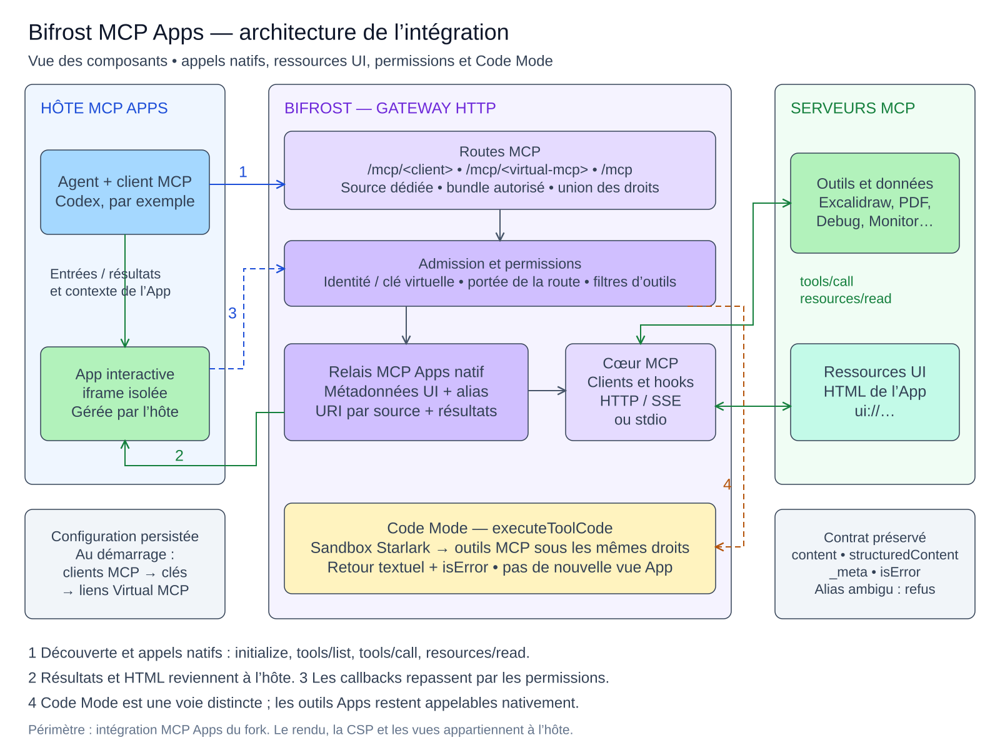

# MCP Apps integration architecture

This component diagram describes the fork's MCP Apps path, including discovery,
native tool calls, UI resources, callbacks, authorization and Code Mode. It is
not a deployment inventory or a diagram of Bifrost's separate LLM inference path.

## Reading the diagram

1. **Discovery and calls.** A compatible host connects to `/mcp` or
   `/mcp/<slug>`. The slug identifies one MCP client or one Virtual MCP. The root
   route serves the caller's combined grants; a named route narrows them.
2. **Native App results.** Bifrost preserves native MCP result fields, including
   `content`, `structuredContent`, `_meta` and `isError`, through its native
   execution path and applicable hooks. It rewrites UI resource references to
   `ui://bifrost/{client}/{resource}` and checks resource reads against an
   authorized linked tool. The host fetches the HTML and owns iframe rendering,
   view lifecycle and enforcement of the App's declared CSP.
3. **Callbacks.** App requests travel through the host and the gateway's admission
   and execution checks. App-only visibility is preserved. An ambiguous original
   callback name is rejected; namespaced calls identify the source explicitly.
   The arrows summarize logical flows rather than every request/response hop.
4. **Code Mode.** `executeToolCode` runs Starlark with the caller's tool access.
   Its output is textual and propagates failures through `isError`; it does not
   create a new App view. Native App tools and callbacks remain available when
   Code Mode is enabled for their client. A script can interact with an existing
   App when the upstream exposes suitable tools.

Configuration startup loads MCP clients, then governance keys, then reconciles
Virtual MCP definitions and key attachments. This order supports a fresh store.
Excalidraw, PDF, Debug and Monitor are tested example servers, not bundled or
mandatory services in the gateway image. Authentication follows the deployment's
configured mode; the diagram does not imply that every installation requires a VK.

## Source map

| Responsibility | Implementation |
| --- | --- |
| Routes, admission, native dispatch and resource access | [`mcpserver.go`](../transports/bifrost-http/handlers/mcpserver.go) |
| UI metadata, source-specific URIs and callback aliases | [`mcpapps.go`](../transports/bifrost-http/handlers/mcpapps.go) |
| Native execution and resource entry points | [`bifrost.go`](../core/bifrost.go) |
| Native App availability alongside Code Mode | [`toolmanager.go`](../core/mcp/toolmanager.go) |
| Script execution and final error propagation | [`Starlark`](../core/mcp/codemode/starlark/) |
| First-boot reconciliation order | [`config.go`](../transports/bifrost-http/lib/config.go) |

Source inspected at `3d77ba0fc6e9dcda3a3cf0e8fd6b096fdd358779`. The released
runtime source is `1fdc8b8700300f5d443939bb8f3fd95cbbb2db39`; the later commit adds
qualification records and probes. See the [qualification report](bifrost-2.2.3-validation.md)
for evidence and remaining host/upstream limitations. The diagram itself is not
an additional interoperability test.

## Files for reviewers and editors

- [SVG](media/mcp-apps-architecture.svg): static preview for GitHub and the PR.
- [Excalidraw scene](media/mcp-apps-architecture.excalidraw): editable offline/importable source.
- [MCP element input](media/mcp-apps-architecture.elements.json): exact input used
  to create the diagram through the Bifrost Excalidraw tool. No credentials or
  deployment addresses are included.

The SVG uses a standard sans-serif font for legibility. The MCP App may use its
own font when rendering the same content. The SVG was rendered in Chromium and
checked for label overflow; this does not assert successful rendering in every
MCP host. After editing a scene, re-export its SVG to keep the preview aligned.
